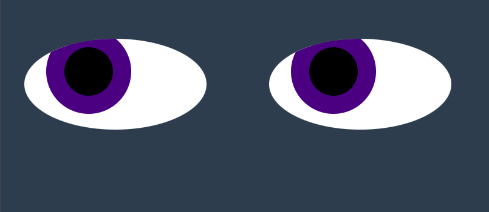

# Moving Eyes

## Description
A pair of eyes is generated from divs that follow the user's mouse around the screen, users are also able to change the colors of the irises. 

Technologies used: HTML, CSS, and JavaScript.

# How to Run
Simply load the webpage and begin to mouse around. To see the code function, visit <a href="https://christianabond.github.io/Eyes">christianabond.github.io/Eyes</a>.

To use the code on your own machine, download or clone the repository. All files within the repository (except for CB_Logo2.png) are required for the code to function properly.

# Roadmap of future improvements
No improvements are planned at this time, although, suggestions are considered.
# Contact info: 
Email: christianalbond@outlook.com

# License Information
The contents of this repository are licensed.

MIT License

Copyright (c) 2023 Christiana Bond

Permission is hereby granted, free of charge, to any person obtaining a copy
of this software and associated documentation files (the "Software"), to deal
in the Software without restriction, including without limitation the rights
to use, copy, modify, merge, publish, distribute, sublicense, and/or sell
copies of the Software, and to permit persons to whom the Software is
furnished to do so, subject to the following conditions:

The above copyright notice and this permission notice shall be included in all
copies or substantial portions of the Software.

THE SOFTWARE IS PROVIDED "AS IS", WITHOUT WARRANTY OF ANY KIND, EXPRESS OR
IMPLIED, INCLUDING BUT NOT LIMITED TO THE WARRANTIES OF MERCHANTABILITY,
FITNESS FOR A PARTICULAR PURPOSE AND NONINFRINGEMENT. IN NO EVENT SHALL THE
AUTHORS OR COPYRIGHT HOLDERS BE LIABLE FOR ANY CLAIM, DAMAGES OR OTHER
LIABILITY, WHETHER IN AN ACTION OF CONTRACT, TORT OR OTHERWISE, ARISING FROM,
OUT OF OR IN CONNECTION WITH THE SOFTWARE OR THE USE OR OTHER DEALINGS IN THE
SOFTWARE.
